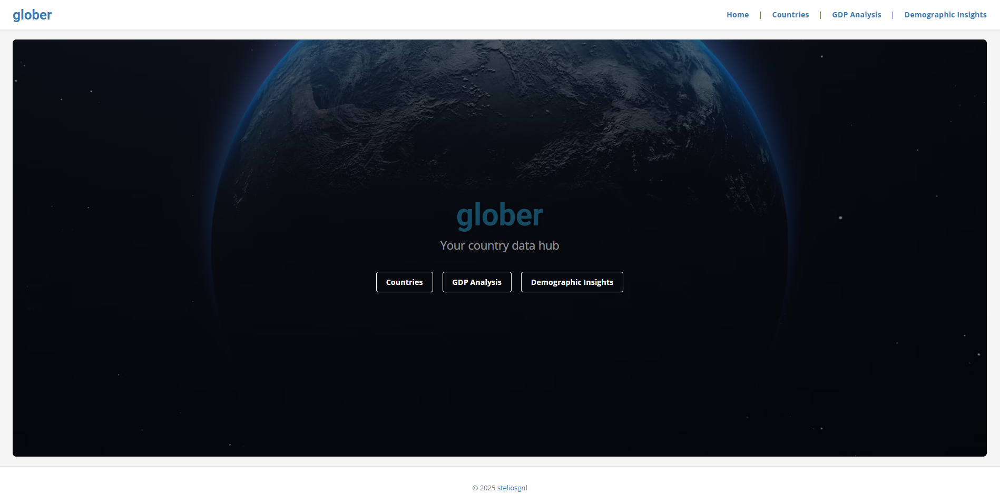
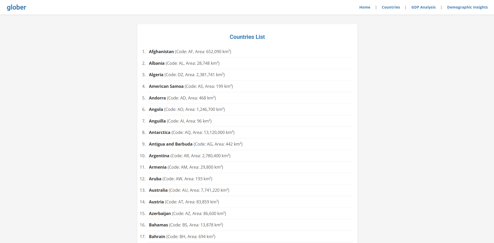
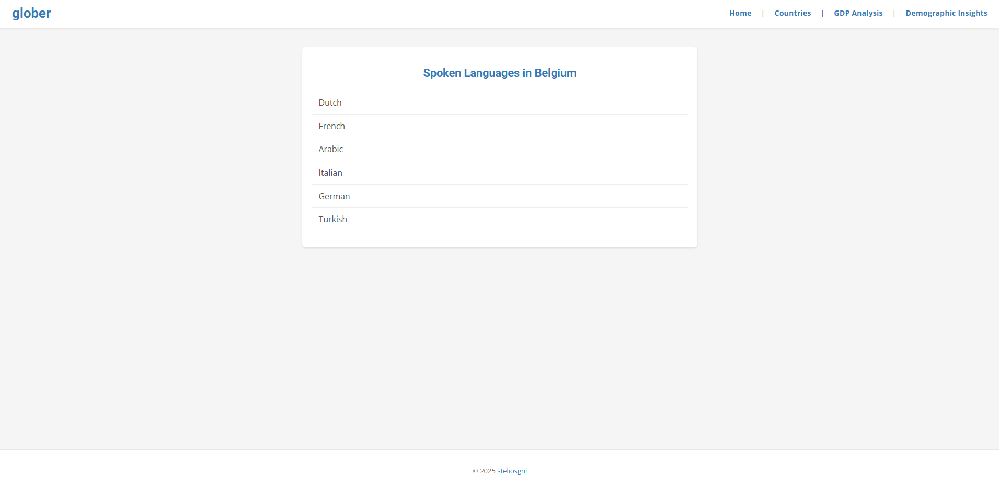
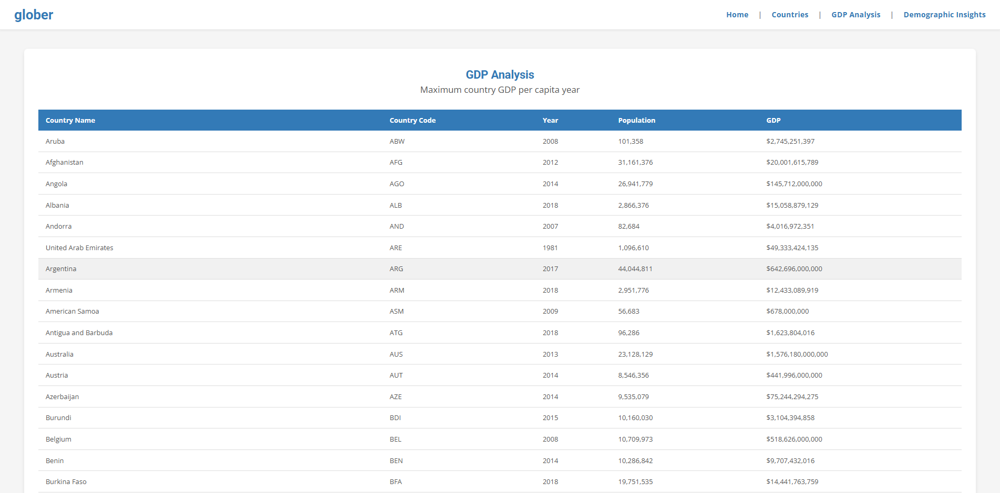
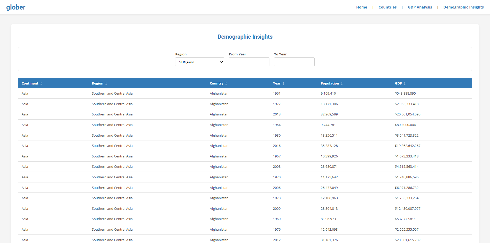

# Glober 🌎

Glober is a full-stack web application designed to explore and analyze global country data. The frontend is built with Angular v20, the backend is powered by Spring Boot 3 and Java 21.

## Features

* **Countries & Languages:** Browse a list of all countries. Clicking on a country displays all of its spoken languages.
* **GDP Analysis:** View the year of maximum GDP per capita for each countryg.
* **Demographic Insights:** A data table displaying detailed continent, region, and country statistics.

## Technology Stack

* **Frontend:** Angular v20
* **Backend:** Spring Boot 3, Spring Data JPA, Hibernate
* **Database:** MariaDB

## Screens

